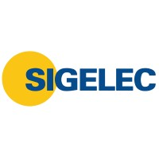

  

<h1 align="center">
Dashboard Comercial – SIGELEC
</h1>

Solución de Business Intelligence desarrollada con Python y Power BI para la automatización de procesos ETL, integración de datos y análisis comercial.

---

> **Proyecto desarrollado durante mis prácticas preprofesionales en SIGELEC.**
>
> Este repositorio forma parte de mi portafolio profesional y tiene como finalidad demostrar la arquitectura, metodología, desarrollo técnico y resultados obtenidos durante el proyecto. **No corresponde a un repositorio oficial de SIGELEC ni contiene información confidencial de la empresa.** Los datos utilizados por la organización han sido excluidos por motivos de confidencialidad.

---

# Descripción

Este proyecto fue desarrollado durante mis prácticas preprofesionales en el área de **Business Intelligence** de SIGELEC con el objetivo de optimizar el análisis comercial mediante la automatización del proceso de obtención, transformación y consolidación de datos provenientes de diversas fuentes.

La solución integra procesos ETL desarrollados en Python, técnicas de Web Scraping para el enriquecimiento de información de clientes, transformación de datos mediante Power Query y la construcción de un modelo analítico en Power BI que permite visualizar indicadores comerciales estratégicos para apoyar la toma de decisiones.

Además de la implementación técnica, el proyecto incluye la documentación completa del proceso de desarrollo, arquitectura de la solución, modelo de datos, dashboards e indicadores comerciales.

---

# Objetivos

- Automatizar la actualización de información comercial mediante procesos ETL.
- Centralizar datos provenientes de diferentes fuentes en un modelo analítico.
- Enriquecer la base de clientes utilizando información pública obtenida mediante Web Scraping.
- Diseñar un modelo de datos optimizado para Power BI.
- Implementar dashboards comerciales con indicadores clave para la toma de decisiones.
- Reducir tareas manuales mediante procesos automatizados desarrollados en Python.
